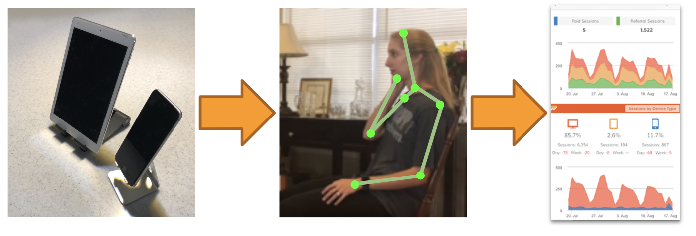
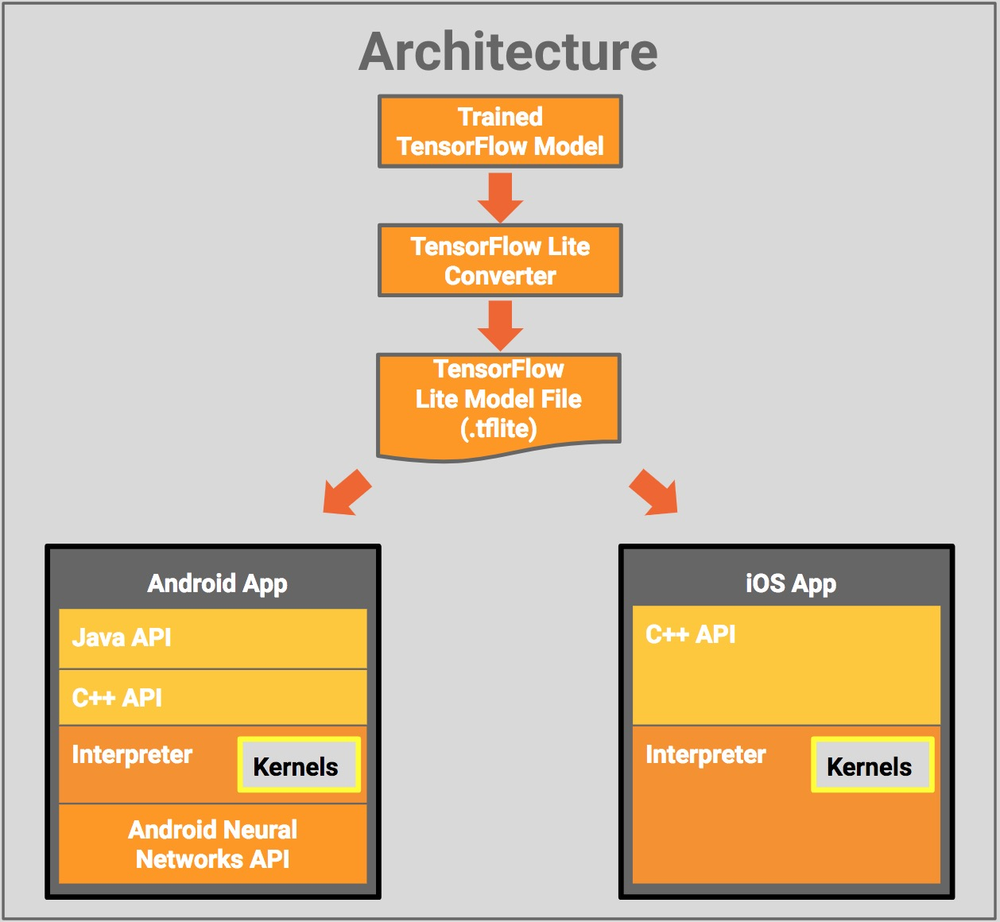

# ReHApp

This project help rehabilitation treatment with only a mobile device.

## DEMO

> Preparing...

## Approach

### 1. Train the pose estimation model

> Researching now...

- [tucan9389/tf2-mobile-pose-estimation](https://github.com/tucan9389/tf2-mobile-pose-estimation)
- [tucan9389/keras-mobile-pose-estimation](https://github.com/tucan9389/keras-mobile-pose-estimation)

### 2. Convert the model for mobile

#### TFLite

#### CoreML

> Preparing...

### 3. Inference the tflite model on mobile device using GPU

- [koomg9599/BodyPoseEstimationAndroid](https://github.com/koomg9599/BodyPoseEstimationAndroid) repo for android application project

## Related works

### Machine learning repository
- https://github.com/tucan9389/tf2-mobile-pose-estimation

### Mobile applicaiton repository
- https://github.com/koomg9599/BodyPoseEstimationAndroid
